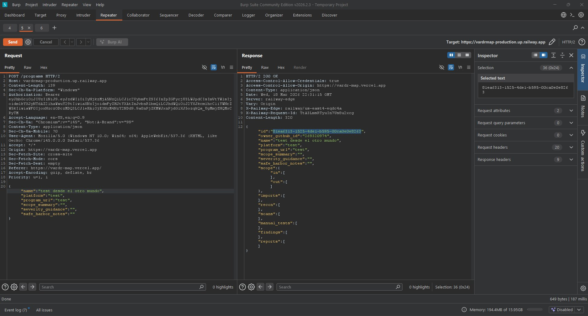
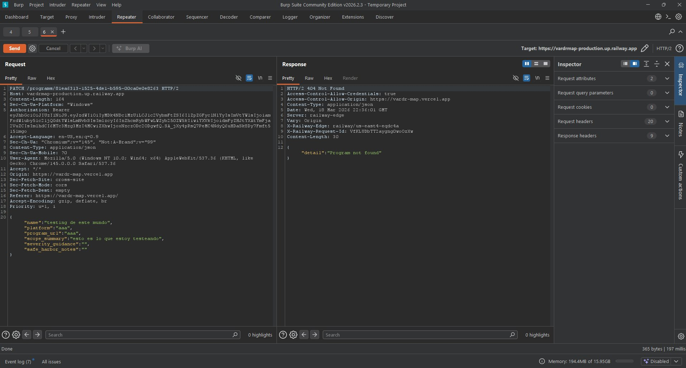
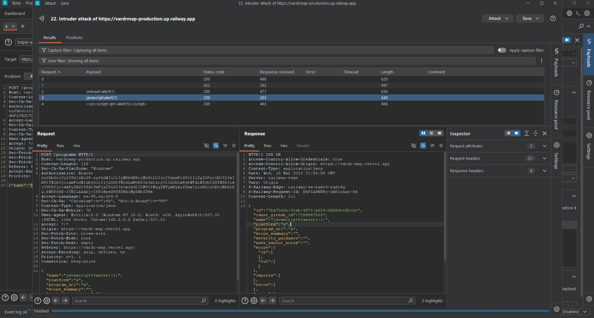
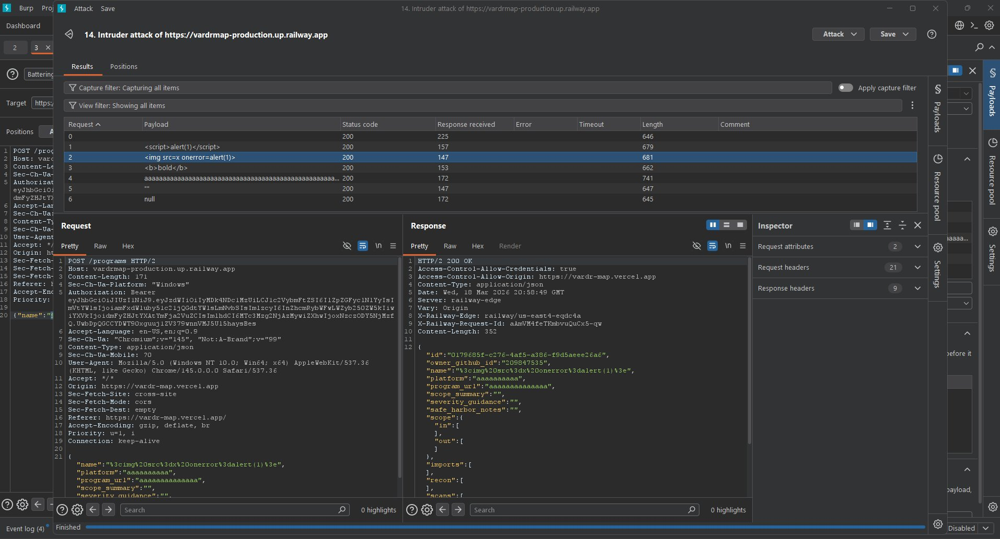
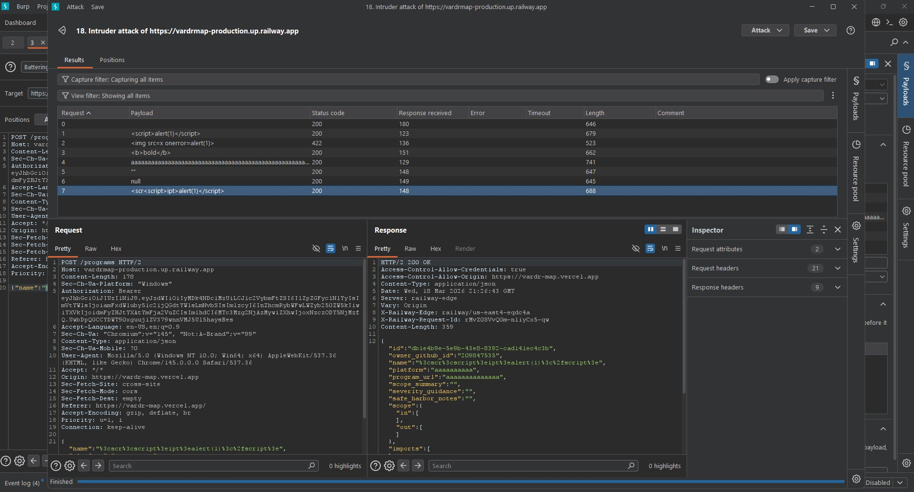
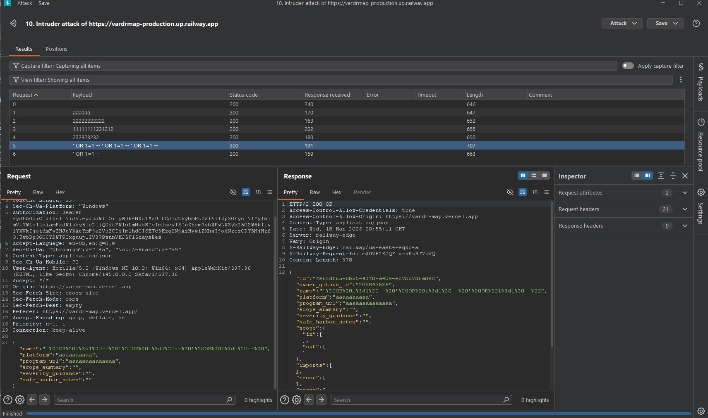

# VardrMap

A full-stack bug bounty workflow tool built with application security principles in mind. Designed to manage target programs, track scope, log findings, and document manual testing — with security controls validated through hands-on testing.

---

## Overview

VardrMap is a personal workflow application for bug bounty hunters and security researchers. It provides a structured environment to organize recon data, track in-scope assets, manage findings, and draft vulnerability reports.

The project was also used as a practical exercise in API security — implementing and testing authentication, authorization, and input validation on a real deployed application.

---

## Tech Stack

- **Frontend:** Next.js 16 — deployed on Vercel
- **Backend:** FastAPI — deployed on Railway
- **Database:** PostgreSQL (Railway-hosted)
- **Auth:** GitHub OAuth via NextAuth → backend-signed JWT (HS256, Bearer token)
- **ORM:** SQLAlchemy

---

## Features

- Create and manage bug bounty target programs
- Track in-scope and out-of-scope assets
- Import tool output (ffuf, httpx, nuclei) via JSON/JSONL upload
- Log recon data, scan results, and manual testing notes
- Track findings with severity, status, and remediation fields
- Draft and preview structured vulnerability reports
- Markdown support in all long-form fields

---

## Security Testing

### Authentication

- All protected API routes require a valid `Authorization: Bearer <token>` header
- Tokens are issued by the backend after GitHub OAuth login completes
- JWT claims include `sub` (GitHub ID), `iss`, `aud`, and expiry — validated on every request
- Requests without a valid token return `401 Unauthorized`

---

### Authorization — BOLA Testing

**Broken Object Level Authorization (BOLA / IDOR)** was tested manually using Burp Suite Repeater with two separate authenticated GitHub accounts.

**Test procedure:**
1. User A created a program via `POST /programs` — captured the returned UUID from the response
2. User B (authenticated with a different JWT) used that UUID in requests via Burp Repeater
3. Tested `PATCH` and cross-user read access using User B's token against User A's program ID

**Results:**

| Request | User | Response |
|---|---|---|
| `POST /programs` | User B | `200 OK` — own program created normally |
| `PATCH /programs/{user_a_id}` | User B | `404 Not Found` |
| `GET /programs/{user_a_id}` | User B | `404 Not Found` |

**Conclusion:**

The backend filters all program queries by both `program_id` and `owner_github_id` derived from the JWT. This is enforced at the database query level by scoping all operations to the authenticated user's GitHub ID — a valid token from a different user returns 404 rather than exposing or modifying the resource. Horizontal privilege escalation is prevented at the query level.

| Screenshot | Description |
|---|---|
|  | User B creates own program (`POST /programs`) — `200 OK`, UUID captured for BOLA test |
|  | User B attempts `PATCH` on User A's program UUID — `404 Not Found`, access denied |

---

### Input Testing

Tested using Burp Suite Intruder (Battering Ram / Sniper) and Repeater against the `name`, `platform`, and other string fields across multiple attack iterations.

**Payloads tested:**

```
<script>alert(1)</script>

<scr<script>ipt>alert(1)</script>
javascript:alert(1)
onload=alert(1)
onerror=alert(1)
<b>bold</b>
' OR 1=1 --
null bytes
oversized strings
```

**Results:**

| Payload | Field type | Response |
|---|---|---|
| `<script>alert(1)</script>` | Short (name) | `422` after fix — `200` pre-fix (stored, not executed) |
| `` | Short (name) | `422` — rejected |
| `javascript:alert(1)` | Short (name) | `422` after fix — `200` pre-fix |
| `onload=alert(1)` | Short (name) | `422` after fix — `200` pre-fix |
| `<scr<script>ipt>alert(1)</script>` | Short (name) | `422` after bleach fix — bypassed regex-only pass |
| `<b>bold</b>` | Long (markdown) | `200` — tags stripped, text `bold` stored |
| `' OR 1=1 --` | Any | `200` — stored as plain text, not interpreted |

**Iterative fix process — documented:**

Initial regex-based sanitization was bypassed by the obfuscated payload `<scr<script>ipt>alert(1)</script>`. The fix was iterated in two passes:

- **Pass 1 (regex):** Caught `` and standard tags — obfuscated variant still bypassed (200)
- **Pass 2 (bleach + pre-strip detection):** Detection runs on raw input before any stripping — obfuscated tag caught and rejected (422)

| Screenshot | Description |
|---|---|
|  | Pre-fix: `<script>`, `javascript:`, `onload=` all return `200` — payloads accepted |
|  | Mid-iteration: `` now `422`, obfuscated `<scr<script>ipt>` still bypasses at `200` |
|  | Post-fix: obfuscated payload returns `422` — bleach + pre-strip detection closes the bypass |
|  | SQLi payloads (`' OR 1=1 --`) return `200` — stored as literal strings, ORM prevents execution |

**Implementation notes:**

- Short identifier fields (`name`, `title`, `asset`) run injection detection on raw input before any stripping — prevents obfuscated tag bypass
- Long-form fields use `bleach.clean()` to strip all HTML while preserving markdown syntax
- SQLAlchemy ORM parameterizes queries, significantly reducing SQL injection risk — payloads are stored as inert strings

---

## Testing Methodology

- **Burp Suite Community Edition** — Intruder (Battering Ram + Sniper), Repeater (manual request manipulation)
- **Multi-account authorization testing** — two real GitHub accounts, separate authenticated sessions
- **Manual API testing** — direct HTTP manipulation bypassing the frontend entirely
- **Payload categories tested** — XSS, obfuscated XSS, event handler injection, SQLi, null bytes, oversized input
- **Iterative fix validation** — each sanitization pass re-tested with the same payload set to confirm coverage

Testing was performed manually and focused on core program endpoints. Additional coverage (nested resources, rate limiting, header injection) is planned.

---

## Screenshots

| Description | File |
|---|---|
| BOLA — User B creates own program (`200 OK`) | `docs/bola-200.png` |
| BOLA — User B denied access to User A's program (`404`) | `docs/bola-404.png` |
| XSS — Pre-fix, all payloads return `200` | `docs/xss-before-fix.png` |
| XSS — Mid-iteration partial fix | `docs/xss-partial.png` |
| XSS — Post-fix, obfuscated payload rejected (`422`) | `docs/xss-after-fix.png` |
| SQLi — Payloads stored as literal strings (`200`) | `docs/sqli-stored.png` |

---

## Future Improvements

- **Rate limiting** — per-user request throttling on auth and write endpoints
- **Security headers** — CSP, X-Frame-Options, HSTS via middleware
- **Audit logging** — record create/update/delete actions with user and timestamp
- **RBAC** — role-based access control for multi-user or team use cases
- **Authenticated scanning** — nuclei/ffuf integration directly from the UI
- **Report export** — PDF/markdown export for findings and reports

---

## Running Locally

**Backend:**
```bash
cd backend
python -m venv venv
.\venv\Scripts\Activate.ps1   # Windows
pip install -r requirements.txt
uvicorn main:app --reload
```

**Frontend:**
```bash
cd frontend
npm install
npm run dev
```

Required environment variables — see `.env.example` in each directory.
